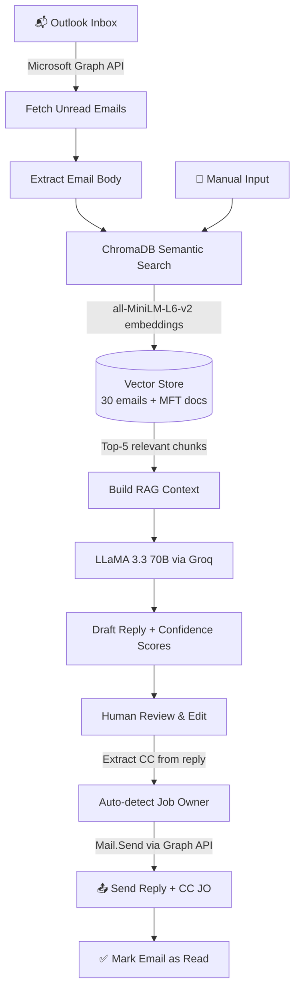

# 📧 MFT Support Email Responder

An AI-powered email automation system for MFT/EDI support teams. Automatically reads Outlook emails, retrieves relevant context from a semantic knowledge base, generates policy-compliant replies, identifies Job Owners, and sends replies with automatic CC — all with one click.

## 🚀 Live Demo

**[Try it here →](https://mft-email-responder-gzxs4yes6ut8dvdruafyue.streamlit.app/)**

## 🏗️ Architecture



## 🛠️ Tech Stack

| Layer | Technology |
|-------|-----------|
| LLM | LLaMA 3.3 70B via Groq API |
| Vector DB | ChromaDB (persistent, disk-based) |
| Embeddings | all-MiniLM-L6-v2 |
| RAG | Custom retrieval pipeline |
| Email Integration | Microsoft Graph API + MSAL OAuth |
| UI | Streamlit |
| Language | Python 3.13 |

## 📋 Features

- **Auto-fetch Outlook emails** via Microsoft Graph API (OAuth device flow)
- **Semantic RAG retrieval** — finds relevant past emails + docs by meaning, not keywords
- **30 past MFT/EDI support emails** indexed as searchable vectors in ChromaDB
- **MFT documentation support** — PDF, DOCX, XLSX, TXT
- **Confidence scores** on every retrieved chunk (🟢 >70% / 🟡 40-70% / 🔴 <40%)
- **Low confidence warning** when no strong match found in knowledge base
- **Policy-compliant replies** — enforces JO approval for password resets
- **Auto CC extraction** — detects Job Owner from TP master list and CC's automatically
- **Human-in-the-loop** — review and edit reply before sending
- **One-click send** via Graph API with automatic mark-as-read
- **Manual input mode** — paste any email and generate reply instantly
- **Retrieved context viewer** — see exactly what the AI used to generate the reply

## ⚙️ Setup

### 1. Clone the repo
```bash
git clone https://github.com/adii1401/mft-email-responder.git
cd mft-email-responder
```

### 2. Install dependencies
```bash
pip install -r requirements.txt
```

### 3. Create `.env` file
```
GROQ_API_KEY=your_groq_api_key_here
AZURE_CLIENT_ID=your_azure_app_client_id
AZURE_TENANT_ID=your_azure_tenant_id
AZURE_CLIENT_SECRET=your_azure_client_secret
```

### 4. Azure App Registration (for Outlook integration)
1. Go to [entra.microsoft.com](https://entra.microsoft.com)
2. App registrations → New registration
3. Add permissions: `Mail.Read`, `Mail.ReadWrite`, `Mail.Send`, `User.Read`
4. Enable **Allow public client flows** under Authentication settings

### 5. Add MFT docs to `docs/` folder
Supported formats: PDF, DOCX, XLSX, TXT

### 6. Run the app
```bash
streamlit run app.py
```

## 💡 Use Case

MFT/EDI support teams handle repetitive email queries daily — connection failures, password resets, EDI mapping errors, partner onboarding. This tool:

1. Reads incoming support emails from Outlook automatically
2. Searches a semantic knowledge base of past resolved tickets + internal SOPs
3. Generates accurate, policy-compliant draft replies using LLaMA 3.3
4. Identifies the responsible Job Owner from the TP master list
5. Sends the reply with automatic CC to the Job Owner — all with one click

**Result:** Support engineers spend seconds reviewing AI-drafted replies instead of minutes writing from scratch.

## 🗺️ Roadmap

- [x] RAG pipeline with past emails
- [x] Multi-format doc support (PDF, DOCX, XLSX, TXT)
- [x] ChromaDB vector database (persistent)
- [x] Semantic embeddings (all-MiniLM-L6-v2)
- [x] Confidence scores with color-coded badges
- [x] Microsoft Graph API (auto-read + send Outlook emails)
- [x] OAuth device flow authentication (MSAL)
- [x] Auto CC extraction + Job Owner identification
- [x] Human-in-the-loop review before sending
- [ ] Follow-up email tracker
- [ ] Production folder structure refactor

## 👤 Author

**Aditya Kumar Gupta**  
MFT/EDI Engineer → AI Automation Engineer  
[LinkedIn](https://linkedin.com/in/your-profile) | [GitHub](https://github.com/adii1401)